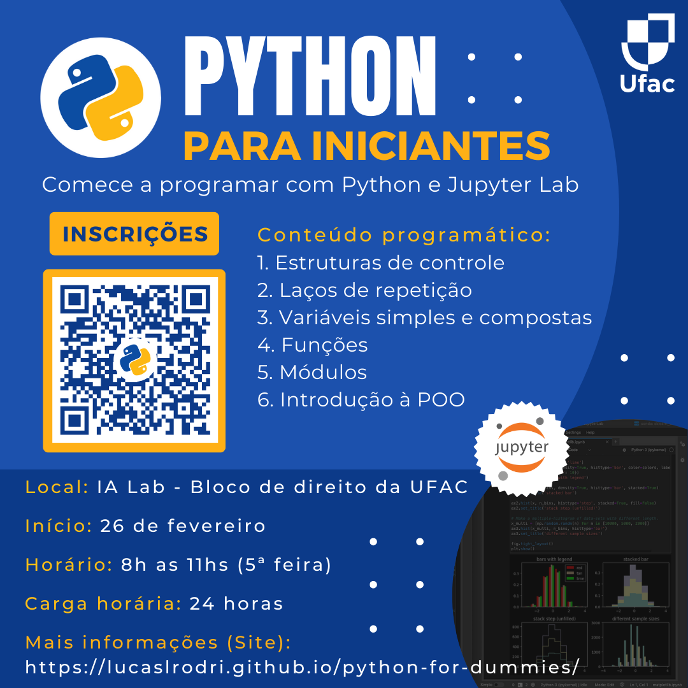
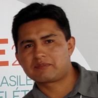
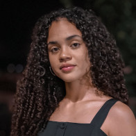

---
hide:
  - navigation
---

# Sobre o curso

  

<a class="md-button md-button--primary" href="https://forms.gle/XGEn2feL2qj1hMEc7" target="_blank" markdown>
    Inscreva-se no curso :octicons-arrow-right-16:{ .lg .middle }
</a>
<a class="md-button whatsapp" markdown href="https://chat.whatsapp.com/JPSWWNuegVKKWH1FpXEhMX" target="_blank">
:material-whatsapp:{ .lg .middle } Grupo do WhatsApp
</a>

Este curso tem como objetivo apresentar os fundamentos da linguagem de programação Python. Durante o curso, serão abordados conceitos essenciais, como variáveis, tipos de dados simples e compostos, funções, controle de fluxo, laços de repetição, módulos e uma introdução à programação orientada a objetos.
Embora o foco principal seja a linguagem de programação, exemplos práticos das áreas de engenharia e matemática serão utilizados para contextualizar e enriquecer o aprendizado. As aulas serão estruturadas com base em Notebooks com o Jupyter Lab, um formato de documento interativo que combina textos, títulos, figuras, equações e códigos Python, promovendo uma integração eficiente entre teoria e prática.

As atividades práticas semanais serão realizadas presencialmente no laboratório de informática IA Lab no bloco de direito da UFAC, permitindo aos participantes consolidar os conceitos aprendidos por meio da aplicação direta. Finalmente, a presença e a entrega dos Notebooks desenvolvidos durante o curso serão utilizadas como critérios de avaliação.

## Informações do curso

**Carga horária:** 24 horas

**Horário:** 8h as 11hs (5ª feira)

**Início:** 27 de fevereiro de 2025

**Link para inscrição:** [https://forms.gle/XGEn2feL2qj1hMEc7](https://forms.gle/XGEn2feL2qj1hMEc7)

## Local do curso

Laboratório de Inteligência Artificial do Curso de Engenharia Elétrica - Bloco de Direito

<iframe src="https://www.google.com/maps/embed?pb=!1m10!1m8!1m3!1d491.2180337714356!2d-67.8670799!3d-9.9552223!3m2!1i1024!2i768!4f13.1!5e0!3m2!1spt-BR!2sbr!4v1739583963310!5m2!1spt-BR!2sbr" width="600" height="450" style="border:0;" allowfullscreen="" loading="lazy" referrerpolicy="no-referrer-when-downgrade"></iframe>

## Plataformas & contato

**Grupo do WhatsAPP:** [https://chat.whatsapp.com/JPSWWNuegVKKWH1FpXEhMX](https://chat.whatsapp.com/JPSWWNuegVKKWH1FpXEhMX)

**Material didático e outras informações:** Este site

## Staff

-  

    **Prof. Dr. Lucas Lima Rodrigues**

-   

    **Prof. Dr. Omar Alexander Chura Vilcanqui**

-   

    **Ian Oliveira Teixeira (Discente)**

-   

    **Clarice Moreira de Oliveira (Discente)**

