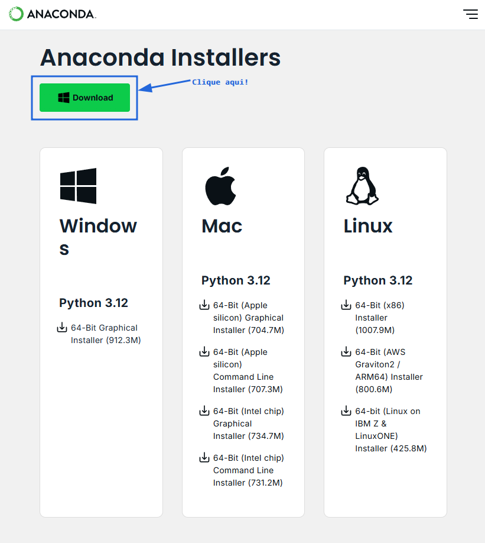

# Introdução ao Jupyter

## Mas afinal o que é o Jupyter Notebok?

O Notebook é um conceito revolucionário, pois permite unir código e texto, assim cada funcionalidade pode ser explicada detalhadamente. Você também pode criar funcionalidades dinâmicas, como gráficos, análise de dados ou outros cálculos, em tempo real.

Utilizando o Jupyter é possível escrever o trabalho da faculdade, relatórios de estágio, fazer anotações para consolidar o aprendizado, desenvolver os estágios iniciais da sua pesquisa científica, ou criar este material didático que você esta lendo neste momento. Veja abaixo algumas imagens do que o Jupyter é capaz.

<figure markdown="span">
  
  <figcaption>Imagem retirada do site do Jupyter Notebook.</figcaption>
</figure>

`Você será capaz de fazer algo parecido com isso em algumas capítulos!`

Por padrão, os códigos do Jupyter Notebook são feitos na linguagem de programação Python. É possível trabalhar com outras linguagens, porém não será abordado neste curso. O texto é feito através da linguagem Markdown, uma linguagem de marcação (ou criação?) tão simples que é possível dominar os conceitos básicos em menos de 10 minutos. Embora simples, o Markdown é uma linguagem poderosa! Por exemplo, partes do site de apoio do curso foi feito utilizando a linguagem Markdown, assim como boa parte desse site.

> **Curiosidade**: O nome Jupyter vem de [**Ju**]lia, [**Pyt**]hon [**e R**], as principais linguagens de programação utilizadas pelos cientistas de dados. É possível utilizar o Jupyter com essas três linguagens, e com outras, como C++.


## E o Jupyter Lab?

O `JupyterLab` é uma evolução do antigo (Porém, ainda bastante usado) ambiente de desenvolvimento `Jupyter Notebook`. Este ambiente de desenvolvimento utiliza tecnologias web mais modernas que o seu velho companheiro, possui alta performance e possui um interface mais flexível e poderosa.

<figure markdown="span">
  
  <figcaption>Imagem retirada do site do Jupyter Notebook.</figcaption>
</figure>

<figure markdown="span">
  

  <figcaption>Imagem retirada do site Towards Data Science.</figcaption>
</figure>

## Anaconda

Existem várias maneiras de instalar um ambiente de desenvolvimento de Python na sua máquina. Uma das maneiras mais práticas é através do **Anaconda**.

Anaconda é uma distribuição gratuita e de código aberto para as linguagens Python e R. Os principais componentes do Anaconda são:

1. **Conda:** Um sistema de gerenciamento de pacotes e ambientes que permite instalar, executar e atualizar pacotes e suas dependências de maneira eficiente. Conda é independente de linguagem, podendo gerenciar pacotes de Python, R e outros.

2. **Pacotes pré-instalados:** A distribuição inclui mais de 300 pacotes populares para engenharia e inteligência artificial, como NumPy, Scipy, Sympy, matplotlib, pandas, scikit-learn, TensorFlow, entre outros. Além disso, oferece acesso a um repositório com mais de 8.000 pacotes adicionais que podem ser instalados conforme a necessidade.

### Instalação do Anaconda (Windows)

1. Primeiramente acesse o site:

<center class="emph-card">
  <a href="https://www.anaconda.com/download/success" target="_blank">https://www.anaconda.com/download/success</a>
</center>

Procure por **Download** e baixe o instalador:

!!!tip "Atenção!"
    Certifique-se que está baixando a versão do anaconda para o seu sistema operacional.

<figure markdown="span">
  { width="100%" }
  <figcaption>Imagem da página de download do Anaconda.</figcaption>
</figure>

2. Depois de baixar inicie o instalador. Siga os passos como a instalação de qualquer outro programa do Windows. Contudo, atente-se para selecionar `Add to my PATH variable`, como mostrado na figura abaixo:


3. Após a instalação certifique-se se o ambiente do Anaconda  está disponível no terminal testando o seguinte comando:

```bash
conda -v
```

